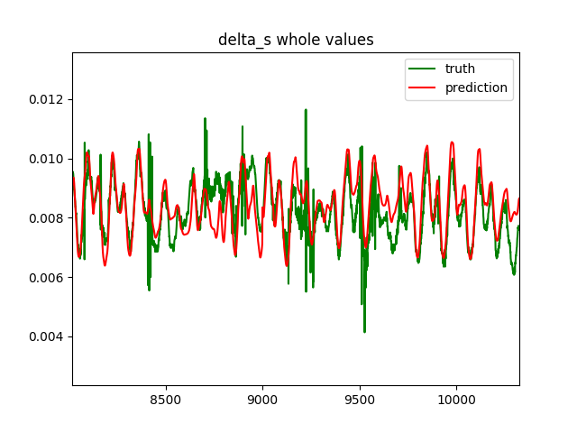
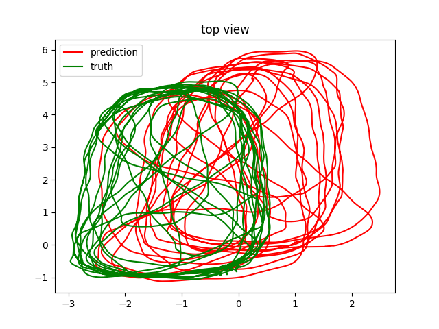

# Lab 7
In this lab we will once again use the 7 step workflow to solve our problem. Our problem this time is to estimate motion for a Pedestrian Dead Reckoning PDR problem. We want to use simple sensors to determine the distance someone is walking. For this we will use the [Oxford Inertial Odometry Dataset](http://deepio.cs.ox.ac.uk/). The Oxford people want you to make a user account to get the data so if you do not want to make an account the instructor will provide the data for you.

## Step 1 Get Some Data
The Oxford Inertial Odometry Dataset OxIOD consists of data collects performed by various users while walking in a controlled environment. The sensor was a standard cell phone that recorded IMU and magnetometer data. For a truth source a Vicon system (think those dot people wear when they make movies) was used to record the motion of the people. There are many different datasets for where the cell phone was relative to the person. We will focus only on the `handheld` data. The cell phone data (our inputs) and vicon data (our truth) are stored in separate files called `imu` and `vi` respectively. We will use the `syn` versions which are already synced in time. Thus, each row in `imu` corresponds to the row of the same number in `vi`. 

You may want to remove the beginning time steps (for example the first 2000) of each dataset because this included the user standing and moving unpredictably in a non-walking fashion. We are only concerned with walking motion in this lab. 

For your reference I have included code that converts 2D absolute position to relative distance angle. I also included a dual function to convert the relative distance and angles back to 2D position.

## Step 2 Measures of Success
Our final problem is to track the motion of the user using the sensors. For this problem we will only be trying to estimate the relative distance change between points in time. If we attempt to estimate absolute position from the Vicon, we will have a problem that will not generalize. Our final metric will be how quickly the predicted position deviates form the true position. Since this is a dead reckoning problem our solution will ultimately drift and be totally wrong, so we will visually look at top down plots to see how well we track the user motion. 

Our baseline is classic step counting that uses the peaks in the vertical IMU axis to determine when the user has stepped and then assume they walk a fixed distance. Since this lab is going to be long enough, and our metric is qualitative we will not use this baseline for anything other than remembering that it exists. Remember we should always have a baseline and in a real problem actually calculate the baseline solution. But, that is beyond the scope for this one week lab. 

## Step 3 Prepare Data
You get to choose what information you want from the `imu` files to use as training data. Remember you may have to scale the data and/or align it as sequences to work. It might make the most sense to takes small sequence chunks out of the larger sequences to use as training. For example randomly pick sequences of length `N` and use them as training. 

The output target will be the distance in the 2D plane using the x, y translation between time steps. We will make a many to many RNN so that each time step in the sequence will output a prediction. 

## Step 4 Evaluation Method
We will use the data folders numbered 1 to 4 for training/validation and data folder 5 as test. 

## Step 5 Develop a model
In this section make a model that uses a many to many input to output relationship with recurrent layers. At this point you just want to get the model to compile. 

Separate this code from the next section with comments or if statements when you get a compiling model.

## Step 6 Overfit Model
Add more layers or other techniques to overfit the model to your training data. 

Again separate this code from the earlier code and later code by comments or if statements.

## Step 7 Regularize Model
Once the model overfits, you can then add regularization to achieve acceptable performance on the validation data. 

Again separate this model from the rest. If this model is the exact same as the one before it then note that in your code.

## Visualization
I want two plots to visualize the prediction. 

First make a plot that shows the prediction of distance at each time step versus the truth distance for an entire run of the data. This means for example I want to see the entire `data5` `imu1` and `vi1` plotted. In order to make this plot you will probably need to use the `stateful` property of the model and/or RNN layers. With `stateful` set to true you can evaluate on smaller sequences and have the state carry over to the next sequence. 

This plot should be thousands of time steps. I have included a plot of a zoomed in look so you can see what I expect for performance but I repeat your plots should be over the entire sequence to prove that you did the `stateful` property correctly.

Next make a top down view of the user motion in 2D over the entire sequence. We will use the true relative angles but our predicted change in distance for this plot. Even with the true relative angles the plot will quickly diverge from the truth x,y but it should not veer off in one direction forever. An good example image is given below:

